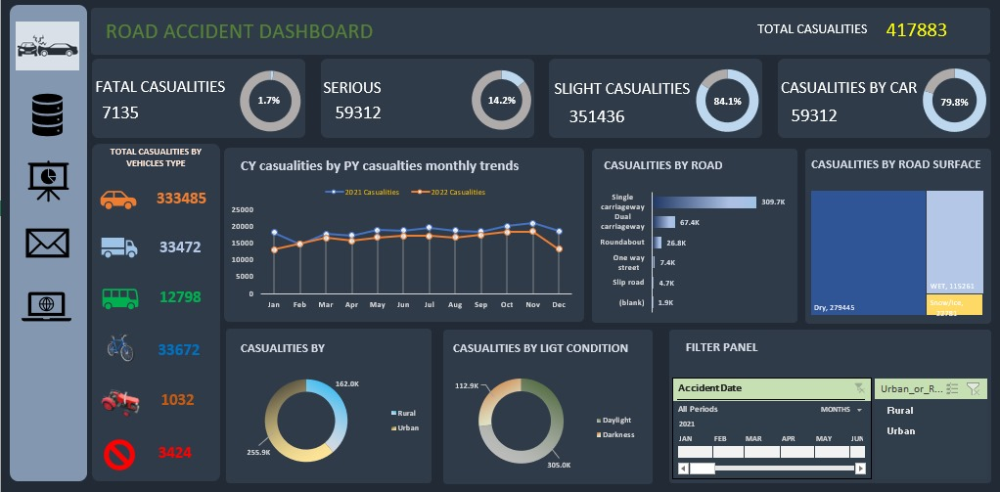

## 📊 Dashboard Preview

# 🚦 UK Road Accident Analysis Dashboard (2021)

## 📌 Project Overview

This project analyzes UK Road Accident Data (2021) to identify patterns in accident severity, road conditions, vehicle involvement, and environmental factors.

Using Microsoft Excel (Pivot Tables, KPI Cards, and Slicers), the raw dataset was transformed into an interactive dashboard that highlights key safety trends and risk indicators.

📊 Total Casualties Analyzed: **417,883**

---

## 📊 Dashboard Preview

---

## 🎯 Business Objectives

- Measure total accident impact and severity distribution  
- Identify high-risk road types and surface conditions  
- Compare Urban vs Rural accident patterns  
- Analyze impact of lighting and weather conditions  
- Understand vehicle type involvement  
- Detect monthly casualty trends  

---

## 📈 Key Performance Indicators (KPIs)

- **Total Casualties:** 417,883  
- **Fatal:** 7,135  
- **Serious:** 59,312  
- **Slight:** 351,436  

🔎 Insight:  
Over 84% of casualties are classified as *Slight*, but serious and fatal cases remain critical from a public safety perspective.

---

## 🚗 Casualties by Road Type

- Single Carriageway – 309.7K  
- Dual Carriageway – 67.4K  
- Roundabout – 26.8K  
- One Way Street – 7.4K  
- Slip Road – 4.7K  

💡 Insight:  
Single carriageways account for nearly 74% of total casualties, making them the highest-risk road type.

---

## 🌧 Casualties by Road Surface Condition

- Dry – 279,445  
- Wet – 115,261  
- Snow/Ice – 22,781  

💡 Insight:  
Most accidents occur during dry conditions, indicating traffic density and driver behavior are major contributing factors.

---

## 🌆 Urban vs Rural Analysis

- Urban – 255.9K  
- Rural – 162.0K  

💡 Insight:  
Urban areas experience more accidents due to higher traffic volume, while rural accidents tend to be more severe.

---

## 🌙 Light Condition Impact

- Daylight – 305.0K  
- Darkness – 112.9K  

💡 Insight:  
The majority of accidents occur during daylight hours, emphasizing traffic flow impact over visibility.

---

## 📅 Monthly Trend (2021)

Highest Casualty Months:
- November – 20,975  
- October – 20,109  
- July – 19,682  

Lowest Month:
- February – 14,648  

💡 Insight:  
Accident frequency peaks during late autumn and summer months, possibly due to seasonal traffic variations.

---

## 🚘 Casualties by Vehicle Type

- Cars – 333,485  
- Vans – 33,472  
- Bikes – 33,672  
- Bus – 12,798  
- Agricultural – 1,032  

💡 Insight:  
Cars contribute to nearly 80% of total casualties, making them the primary focus area for road safety improvements.

---

## 🛠 Tools & Techniques Used

- Microsoft Excel (Pivot Tables, KPI Cards, Slicers)  
- Data Cleaning & Transformation  
- Aggregation & Comparative Analysis  
- Trend Analysis  
- Dashboard Design & Data Storytelling  

---

## 💼 Business Impact

This analysis can support:

- Government road safety strategy development  
- Insurance risk modeling  
- Traffic enforcement allocation  
- Urban infrastructure redesign  
- Speed regulation policy decisions  

---

## 🧠 Skills Demonstrated

- Data Cleaning  
- Exploratory Data Analysis (EDA)  
- KPI Development  
- Dashboard Design  
- Analytical Thinking  
- Business Insight Communication  

---

## 🚀 Future Enhancements

- Power BI interactive dashboard version  
- Geographic heatmap using latitude & longitude  
- Predictive modeling for accident severity  
- Risk scoring model by road type  

---

## 👨‍💻 Project Summary

This project demonstrates the ability to transform raw accident data into meaningful business insights through structured analysis and dashboard visualization. It highlights strong analytical thinking and data storytelling skills applicable to real-world decision-making scenarios.
